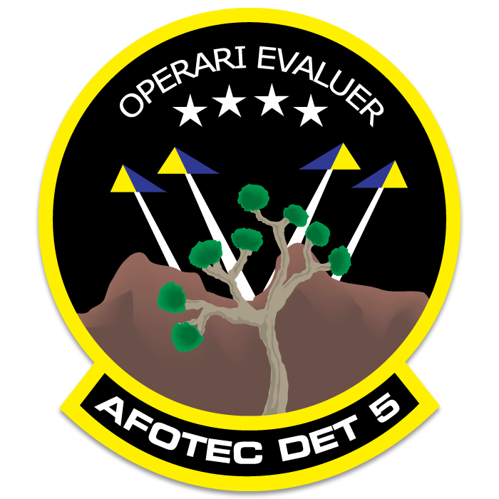

<!-- PROJECT SHIELDS -->
<!--
*** I'm using markdown "reference style" links for readability.
*** Reference links are enclosed in brackets [ ] instead of parentheses ( ).
*** See the bottom of this document for the declaration of the reference variables.
*** https://www.markdownguide.org/basic-syntax/#reference-style-links
-->

<!-- PROJECT LOGO -->
 

  

  <h3 align="center">AFOTEC Test Dashboard</h3>

  

    project_description
     
    <a href="https://github.com/spaceman35/Test-Dashboard"><strong>Explore the docs »</strong></a>
     
    <a href="https://github.com/spaceman35/Test-Dashboard/issues">Report Bug</a>
    ·
    <a href="https://github.com/spaceman35/Test-Dashboard/issues">Request Feature</a>
  

<!-- TABLE OF CONTENTS -->
  
<h2 style="display: inline-block">Table of Contents</h2>

  <ol>
    <li>
      <a href="#about-the-project">About The Project</a>
      <ul>
        <li><a href="#built-with">Built With</a></li>
      </ul>
    </li>
    <li>
      <a href="#getting-started">Getting Started</a>
      <ul>
      </ul>
    </li>
    <li><a href="#usage">Usage</a></li>
    <li><a href="#roadmap">Roadmap</a></li>
    <li><a href="#contributing">Contributing</a></li>
    <li><a href="#contact">Contact</a></li>
  </ol>

<!-- ABOUT THE PROJECT -->
## About The Project

### Built With

* [R](https://www.rstudio.com/)
* [Shiny](https://shiny.rstudio.com/)
* [Databricks](https://databricks.com/)

<!-- GETTING STARTED -->
## Getting Started
Add instructions to get everything working

<!-- USAGE EXAMPLES -->
## Usage

Use this space to show useful examples of how a project can be used. Additional screenshots, code examples and demos work well in this space. You may also link to more resources.

_For more examples, please refer to the [Documentation](https://example.com) (populate this documentation page later)_

<!-- ROADMAP -->
## Roadmap

See the [open issues](https://github.com/spaceman35/Test-Dashboard/issues) for a list of proposed features (and known issues).

<!-- CONTRIBUTING -->
## Contributing

Contributions are what make the open source community such an amazing place to learn, inspire, and create. Any contributions you make are **greatly appreciated**.

1. Fork the Project
2. Create your Feature Branch (`git checkout -b feature/AmazingFeature`)
3. Commit your Changes (`git commit -m 'Add some AmazingFeature'`)
4. Push to the Branch (`git push origin feature/AmazingFeature`)
5. Open a Pull Request

<!-- CONTACT -->
## Contact

Maj Sean Kelly, AFOTEC Det 5 - sean.kelly.33@spaceforce.mil 
Lt Timothy Dawson, AFOTEC Det 5 - timothy.dawson.7@us.af.mil 
Project Link: [https://github.com/spaceman35/Test-Dashboard](https://github.com/spaceman35/Test-Dashboard)

<!-- MARKDOWN LINKS & IMAGES -->
<!-- https://www.markdownguide.org/basic-syntax/#reference-style-links -->
